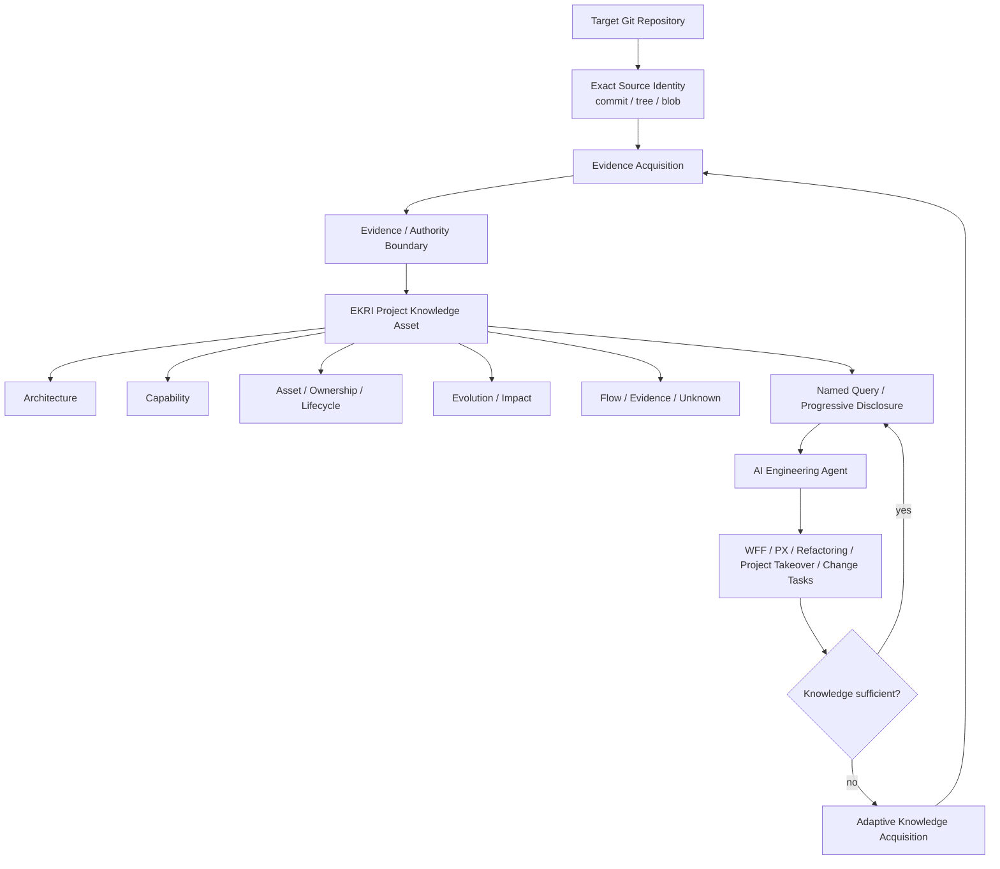
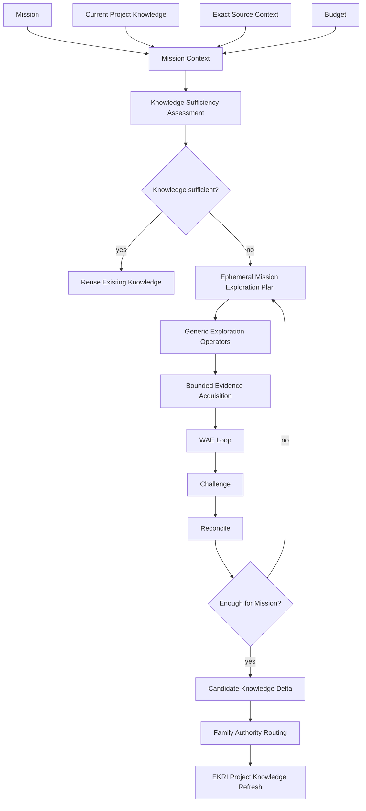

# EKRI — Engineering Knowledge Reconstruction and Intelligence

**让 AI 不必每次重新“读懂整个项目”，而是基于一份可信、精简、持续更新的工程知识资产工作。**

EKRI（Engineering Knowledge Reconstruction and Intelligence）面向大型、长期演化的软件项目，将代码库中的工程事实、结构关系、能力、所有权、生命周期、流程和变化信息，重建为一份：

- **精简的**：不把整个代码库或完整调用图塞进长期知识；
- **渐进披露的**：先回答“有没有、在哪里、归谁、有什么约束”，需要时再向证据和源码展开；
- **证据绑定的**：知识绑定精确 Git commit / tree / blob 与可验证证据；
- **与项目演化同步的**：能够识别 stale / missing / conflicting knowledge，并按任务增量刷新；
- **面向 AI 消费的**：优先服务 Agent 查询、决策和生成前检查，而不是把内部模型做成人类文档系统。

> EKRI 的核心不是“扫描代码”，而是维护一份可靠的 **Project Engineering Knowledge Asset**。

当前公开版本：**EKRI v1.1.0**。

---

## EKRI 解决什么问题

大型存量项目里，AI 最昂贵、也最危险的行为之一，是每次任务都从源码重新建立项目认知。

典型问题包括：

- **重复理解**：每个新会话都重新搜索入口、调用链、模块关系和已有能力；
- **上下文浪费**：大量源码进入上下文，但真正影响决策的边界、能力、约束和所有权只占很小一部分；
- **知识漂移**：昨天正确的项目理解，在代码重构、移动、拆分后可能已经过期；
- **重复造轮子**：Agent 不知道项目已经存在某个 Capability，于是重新生成平行实现；
- **重构风险不透明**：知道某几个文件相似，却不知道各自消费者、owner、兼容面、生命周期与真实职责；
- **虚假确定性**：结构引用、测试、文档或历史信息被错误升级成语义真相；
- **项目接手成本高**：AI 或工程师需要大量时间才能形成“这个系统到底有什么、怎么协作、哪里不能乱动”的基本认知。

EKRI 的目标是把这些一次性的认知成本，转化为**可复用、可验证、可增量维护的工程知识基础设施**。

---

## 产品定位

EKRI 可以理解为 AI 软件工程中的一个 **Engineering Knowledge Substrate（工程知识底座）**。

它回答的不是单纯的：

> “代码里有哪些类和函数？”

而是更接近：

> “这个项目已经知道什么？这个结论为什么可信？当前版本还成立吗？如果我要做这次工程任务，还缺哪些知识？”

### EKRI 不是

- 不是传统代码搜索或全文索引；
- 不是一个永久保存全部 Code Graph 的数据库；
- 不是 Architecture Markdown / UML 文档生成器；
- 不是 WFF PX 的竞争实现；
- 不是自动重构、自动删除或自动 ownership 判定器；
- 不是依赖 Java / Spring / Go / Python 等固定技术栈 Profile 的扫描框架；
- 不把“没有发现”自动解释成“不存在”。

### EKRI 与 WFF / PX

WFF 负责软件工程生命周期和任务推进；PX 负责当前变更的存量系统评估与路径选择；EKRI 负责可复用的项目工程知识。

```text
WFF / PX / Engineering Agent
            │
            │ query / knowledge sufficiency
            ▼
     EKRI Project Knowledge
            │
            │ missing / stale / conflicting
            ▼
 Adaptive Knowledge Acquisition
            │
            │ bounded evidence refresh
            ▼
     EKRI Project Knowledge
```

因此更准确的关系是：

> **EKRI 是 PX / Agent 可以消费的知识底座之一，而不是替代 PX 的 Workflow。**

---

## EKRI 维护什么知识

EKRI v1.x 的 Project Knowledge 采用相对稳定、技术栈无关的工程知识抽象。

主要知识切片包括：

| Knowledge Family | 回答的问题 |
|---|---|
| **Architecture** | 系统主要边界、职责和结构如何组织？ |
| **Capability** | 项目已经具备哪些工程/产品能力？如何实现？ |
| **Asset Identity** | 一个工程资产是谁，而不仅仅是“现在在哪个路径”？ |
| **Ownership Boundary** | 哪些 owner / responsibility 有证据支持，哪些仍未确定？ |
| **Lifecycle Observation** | 资产当前是否被正式分发、维护、兼容或观察到使用？ |
| **Evolution / Impact** | 什么发生了变化？哪些区域可能受到影响？ |
| **Flow / Handoff** | 关键流程和交接关系如何发生？ |
| **Evidence / Authority** | 每条知识的证据、来源、可信边界是什么？ |

知识状态不会被强行压成“对/错”二元值。EKRI 显式保留：

```text
observed
inferred
unknown
conflicting
blocked / stale
```

这意味着：**不知道就是不知道，有冲突就保留冲突，而不是为了得到一张漂亮的架构图制造确定性。**

---

## 核心架构



核心边界是：

```text
动态：如何探索、先看哪里、看多深、用什么证据
稳定：知识语义、Identity、Evidence、Authority、Unknown/Conflicting
```

探索过程可以灵活，但进入 EKRI 的知识必须经过稳定的证据与权威约束。

---

## v1.1：Adaptive Knowledge Acquisition

EKRI v1.0 建立了稳定的 Engineering Knowledge System；v1.1 的重点不是增加新的语义知识体系，而是让 AI **更聪明地获取和刷新知识**。

v1.1 不维护：

```text
profiles/java/
profiles/go/
profiles/python/
profiles/react/
...
```

相反，它维护一套稳定的探索原则和通用操作符，让 Agent 针对当前任务动态生成一次性探索计划。

### 自适应探索链



### WAE 在这里负责什么

WAE 用于 bounded iterative deepening：

```text
assess
→ select highest-value gap
→ acquire bounded evidence
→ challenge
→ reconcile
→ re-assess
→ converge / return / block
```

它解决“固定阶段”和“需要迭代”之间的矛盾。

探索深度不是提前硬编码成“必须读 500 个文件”，而是在 Mission、风险、知识缺口、信息增益和预算约束下逐轮收敛。

### 动态的是计划，不是知识语义

v1.1 的重要原则：

> **探索计划可以不稳定，知识语义必须稳定。**

两个 Agent 可以采用不同探索顺序，但它们不能因为计划不同就随意改变：

- semantic identity；
- evidence requirements；
- authority ownership；
- unknown / conflicting 的处理方式；
- source binding；
- Project Knowledge family 的含义。

---

## 不依赖技术栈 Profile

EKRI v1.1 使用通用探索操作符，例如：

```text
discover-entrypoints
inspect-contracts
inspect-state-and-data
trace-flow
assess-freshness
map-ownership
expand-structural-neighborhood
locate-unknowns-and-conflicts
```

具体项目中的 Java annotation、Python route、TypeScript API client、DDL、Kubernetes manifest 等，只是可选择的**证据来源或轻量 Collector**，不能直接制造语义真相。

v1.1 的异构 conformance 使用同一套 Constitution / Plan / WAE contract，分别处理了：

- service / contract / state；
- interaction client；
- data pipeline；

不需要维护三套技术 Profile。

---

## 为什么要渐进披露

EKRI 不是让 Agent 每次加载完整项目模型。

普通问题通常只需要：

```text
有没有这个 Capability？
在哪里？
由谁负责？
哪些限制已知？
当前知识是否新鲜？
```

只有需要时才继续展开：

```text
realizations
→ related assets
→ consumers / owners
→ flow / lifecycle
→ evidence
→ exact Git source
```

这使大型项目的工程知识可以长期丰富，但单次 Agent 上下文仍保持小而相关。

---

## v1.1 的一个实际收益证明

在同一 WFF v1.9.2 target、同一组 7 个工程知识问题上：

```text
From zero:
7 questions → 7 exploration gaps → 7 planned slices

Reuse existing EKRI Project Knowledge:
6 questions → existing knowledge reusable
Architecture → explicit blocked-source-contract-drift
→ only 1 planned exploration slice
```

对应 planned ceilings：

```text
planned slices             7 → 1
planned tool-call ceiling  7 → 1
planned source expansions 28 → 4
```

这个审计证明的是 **planned exploration economy**，不是对实际 token、时间或金钱节省的夸大声明。

同时，已知的 Architecture gap 没有为了提高“复用率”而被隐藏。

---

## 版本与发布模型

从 EKRI v1.1 开始，源码与公开分发明确分离：

```text
rv198-star/software-lifecycle-skills
    source tag: ekri/vX.Y.Z
              │
              │ audited release pack
              ▼
rv198-star/ekri-release
    public main: unpacked runtime/source distribution
    public tag:  vX.Y.Z
    GitHub Release: ZIP + manifest + SHA256SUMS
```

当前版本：

```text
EKRI v1.1.0
source tag: ekri/v1.1.0
public tag: v1.1.0
```

`EKRI_RELEASE_PACK_MANIFEST.json` 是 release pack 的权威文件清单和 source identity 记录。

---

## 快速验证

EKRI Formal Scanner 使用 Git-backed scanner-control trust model。

```bash
python3 EKRI/scripts/validate_observation_boundary.py \
  --repository-root /path/to/target-repository \
  --target-ref HEAD
```

Formal Scanner 会在以下情况 fail closed：

- active EKRI implementation 未提交或 dirty；
- scanner provenance 无法解析；
- target Git identity 无法验证；
- protected EKRI / `.EKRI` surface 试图进入正式 observation corpus。

更多入口：

```text
EKRI/README.md
EKRI/CHANGELOG.md
EKRI/docs/adaptive-knowledge-acquisition-v1.1.md
EKRI/docs/releases/v1.1.0.md
EKRI_RELEASE_PACK_MANIFEST.json
```

---

## 当前边界

EKRI v1.1 不声称：

- 穷尽整个软件项目的所有知识；
- 自动判断 safe delete / merge / refactor；
- 自动拥有业务、架构或 ownership 决策权；
- 已实现 PX 路由控制；
- 已实现全项目 Convergence Candidate Discovery；
- 已实现 Human Projection 产品；
- 已证明真实 UAT、production readiness 或 owner approval。

它提供的是一个更基础的能力：

> **让 AI 面对长期演化的软件项目时，可以先查询一份可信工程知识资产，只对真正缺失、过期或冲突的部分继续探索，而不是每次从零重新理解代码库。**

---

## License / Source

EKRI 的正式源码版本来自 `rv198-star/software-lifecycle-skills` 中的 `ekri/vX.Y.Z` source tag。

本仓库 `rv198-star/ekri-release` 是 EKRI 的独立公开分发仓库，从 v1.1 起承载展开后的 runtime/source distribution 与正式 GitHub Release 资产。
